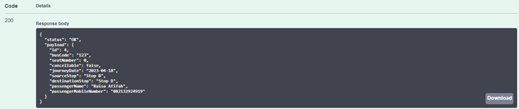

# [Final Project Java Kelompok 4](https://github.com/aditya-f/final-project-java-bus-reservation)

## Oleh:

- Aditya Fahrezantara
- Raisa Afifah
- Rucidi Kelikualiq

---

## Penambahan Fitur

### Poin

- Poin akan diberikan kepada user yang melakukan pembelian tiket bus. User akan mendapakan tambahan 100 poin setiap pembelian tiket.
- Poin yang didapatkan disimpan di database di tabel user sehingga poin akan selalu disimpan walau program sedang tidak dijalankan.

---

## Cara Menggunakan API

### A. Login Menggunakan Swagger

1. Pada homepage swagger aplikasi, klik dropdown menu di kanan atas dan pilih “User”.
   

2. Scroll ke bawah dan klik API Login.
   
   

3. Klik tombol “Try it out” dan masukkan email beserta password dari akun yang telah dibuat. Kemudian klik tombol “Execute”.
   

4. Scroll ke bawah dan lihat bagian “Response header”. Pada bagian tersebut, jika login berhasil terdapat object “authorization” dengan value yang diawali dengan kata “Bearer”. Copy keseluruhan value dari object “authorization”.
   

5. Scroll kembali ke bagian atas dan klik tombol “Authorize”.
   
   

6. Paste value “authorization” yang sebelumnya sudah di-copy ke dalam kolom “Value” dan klik tombol “Authorize”. Anda berhasil login.
   

### B. Booking Tiket Bus

1. Pada homepage swagger aplikasi, klik dropdown menu di kanan atas dan pilih “BRS”.
   

2. Klik “bus-reservation-controller”.
   

3. Klik API Book Ticket.
   
   

4. Klik tombol “Try it out” dan masukkan Trip Date beserta Trip ID. Kemudian klik tombol “Execute”.
   

5. Jika berhasil, maka akan muncul output seperti gambar berikut.
   

6. Kemudian buka database dan buka tabel “user”, maka poin user akan bertambah.
   
   
